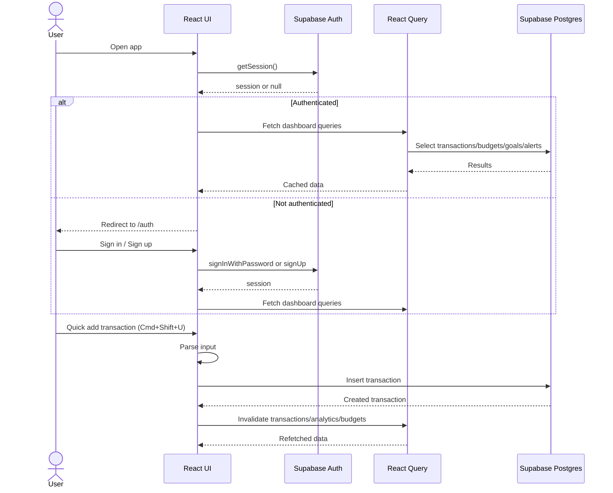

# Quell Money Minder

A personal finance web app built with Vite, React, TypeScript, shadcn-ui, Tailwind, and Supabase. It provides dashboards, transactions, budgets, goals, recurring entries, and alerts with authenticated access and per-user data isolation.

**What This Repo Contains**
- Frontend app in `src/` with React Router, React Query, and UI components.
- Supabase client and typed data models for finance entities.
- Database schema and RLS policies in `supabase/migrations/`.

**Key Features**
- Authenticated access with email/password and Google OAuth.
- Dashboard analytics, budgets, goals progress, and recent activity.
- Transactions with categories and tags.
- Recurring transactions with pause/resume.
- Alerts with unread count and marking read.
- Quick add transaction via Spotlight (Cmd+Shift+U) with a natural language parser.

**Architecture Overview**
- Routing is handled by React Router with a protected app shell. Authenticated users land on `/dashboard`, and unauthenticated users are redirected to `/auth`.
- React Query manages server state, caching, and invalidation after mutations.
- Supabase provides authentication and the Postgres database. Row Level Security (RLS) ensures each user can only access their own data.

**Sequence Diagram**


**Data Model Summary**
- `profiles`, `user_preferences`
- `categories`, `tags`, `transaction_tags`
- `transactions`, `recurring_transactions`
- `budgets`, `goals`, `goal_contributions`
- `alerts`, `ai_suggestions`, `audit_logs`

**Important Flows**
- Auth and profile bootstrap is handled by Supabase. A DB trigger creates a profile, preferences, and default categories for new users.
- Budget status is computed client-side by combining monthly budgets with expense transactions for the same month.
- Insights are deterministic and computed from analytics summary.
- Goal progress is computed client-side and updated via `goal_contributions` triggers.

**Local Development**
```sh
npm i
npm run dev
```

**Tests**
```sh
npm run test
```

**Environment Variables**
Create a `.env` with:
- `VITE_SUPABASE_URL`
- `VITE_SUPABASE_PUBLISHABLE_KEY`

**Primary App Entry Points**
- `src/main.tsx` mounts the React app.
- `src/App.tsx` defines routes and providers.
- `src/hooks/*` contains data fetching and mutations.
- `supabase/migrations/*` contains the database schema and policies.
